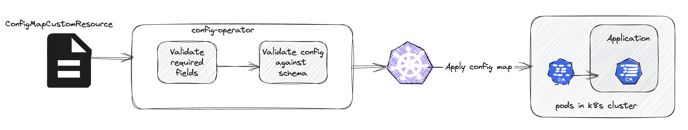
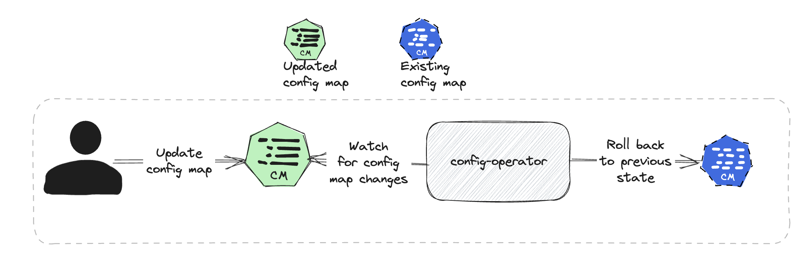
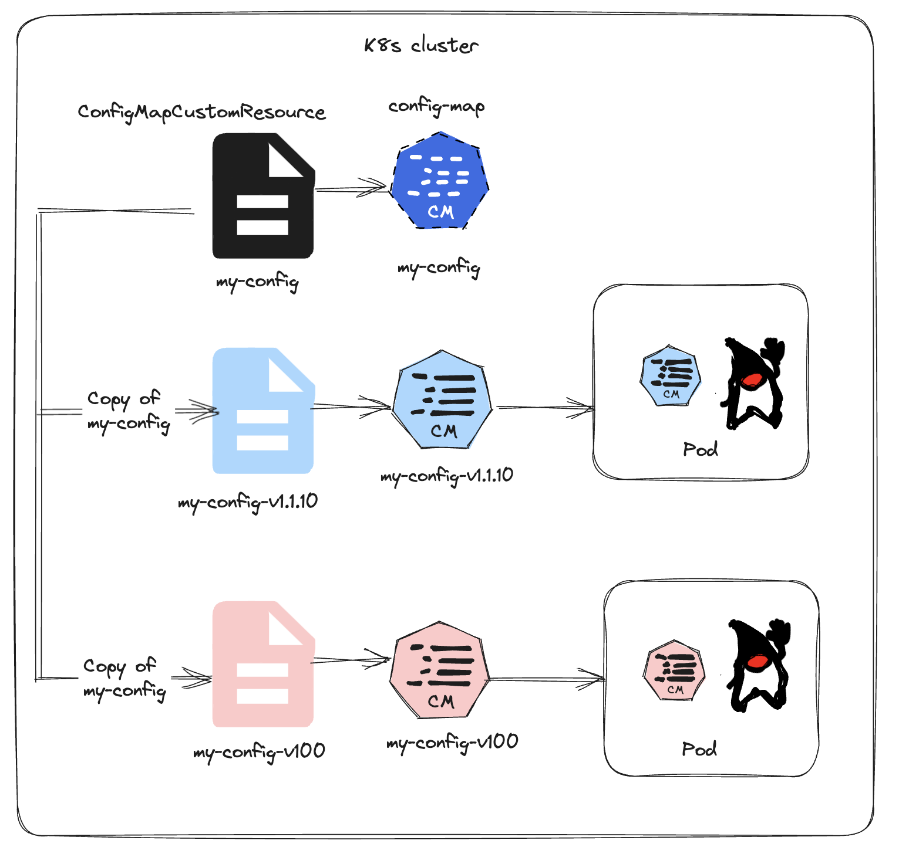

# k8s-custom-configmap

`k8s-custom-configmap` is a custom k8s config-map resource which includes JSON data validation and create
versioned config-maps as requested by the application.

## Objective

Kubernetes (K8s) config maps are widely employed for managing both runtime and static configurations. However, their
flexibility can pose challenges when it comes to maintaining and modifying them while simultaneously ensuring the
stability of dependent applications.

The core objective of this tooling is to implement a well-defined opinionated safety net. This includes the following principles:

1. Ad-hoc changes to the data in config-map directly within the cluster should undergo validation before being mounted in the pods.

2. Config map data must undergo validation during the continuous integration (CI) process before releasing the config maps.

3. Each deployment should maintain its own version of a config-map. In the event of faulty changes to the config-map, this approach facilitates the seamless redirection of traffic to the last known working state with minimal impact. Additionally, this practice provides us with the capability to conduct A/B testing for new configurations.

## Components
### Custom config-map resource

The custom config-map resource is an extension of the native k8s config-map resource. The custom resource has an
additional required field `schema`
where the users can define the schema for the respective data in the config map.

**Example**

```yaml
apiVersion: "rcube.com/v1"
kind: ConfigMapCustomResource
metadata:
  namespace: your-namespace
  name: application-toggles-config
spec:
  config:
    data:
      application-toggles-config.json: |
      {
        "startNewFlow": true
      }
    schema:
      application-toggles-config.json: |
      {
        "type": "object",
        "properties": {
          "startNewFlow": {
            "type": "boolean"
          }
        },
        "required": [
          "startNewFlow"
        ]
      }
```

### config-operator

The config-operator watches config-map CRD resources and k8s deployment resources. The operator is responsible for the
below operations.

- Validate custom config-map resources against the schema
- Create config-maps from the custom resource.
- Restricts direct changes to the native config-map resource.
- Create versioned custom config-map resources for the applications.

## Features

| Terminology                                                                | Explanation                              |
|----------------------------------------------------------------------------|------------------------------------------|
| operator, config-operator                                                  | Refers to the config-operator            |
| config-map, native config-map, k8s config-map                              | Refers to the k8s config-map             |
| custom config-map resource, configmapcustomresources, k8s-custom-configmap | Refers to the custom config-map resource |

### Validate config-map JSON data against JSON schema

Before generating the required config map, the config operator validates the JSON `data` within the configuration against a JSON `schema`, adhering to the [Draft-4](https://json-schema.org/specification-links#draft-4) convention. This ensures that the configuration adheres to the specified structure and standards.



### Restricts direct changes to the native config-map resource

To maintain control and consistency, the config-operator imposes restrictions on direct alterations to the native config-map resource. By actively monitoring dependent resources linked to the custom config-map, the operator resets any manual changes made to these resources. This proactive measure guarantees that config-maps can only be updated through modifications to the custom config-map resource, thus enforcing proper validation procedures.



### config-map versioning

The operator offers the flexibility to deploy versioned config-maps and seamlessly integrate them into the application.
This is achieved by specifying the desired configuration version in the deployment manifest labels and appending the
corresponding version suffix to the referenced config-map within the volumes.

An example deployment requesting a versioned config-map.

```yaml
apiVersion: apps/v1
kind: Deployment
metadata:
  name: nginx-deployment
  namespace: local
  labels:
    app: nginx
    config-map-version: "v1.1.10"
spec:
  replicas: 2
  selector:
    matchLabels:
      app: nginx
  template:
    metadata:
      labels:
        app: nginx
    spec:
      containers:
        - name: nginx
          image: nginx:1.14.2
          volumeMounts:
            - name: my-config
              mountPath: /etc/config
          ports:
            - containerPort: 80
      volumes:
        - name: my-config
          configMap:
            name: "my-config-v1.1.10"
```

In the above example the deployment requests for config-map `my-config-v1.1.10` (in the
format `{config-map}-{config-map-version}`). The deployment manifest also
has a `label` with key value `config-map-version: "v1.1.10"` which is the pre-requisite to trigger versioning.

When the deployment manifest is applied, the operator retrieves the specified config-map, which in this case
is `my-config-v1.1.10`, from the deployment resource. It then checks if there's an existing `ConfigMapCustomResource`
with the name `my-config-v1.1.10`. If this custom resource doesn't exist, the operator duplicates
the `ConfigMapCustomResource` from the pre-existing `my-config` (which should already be present in the namespace).
Subsequently, the operator creates another custom resource with the name `my-config-v1.1.10`, resulting in the
generation of a corresponding native config-map named `my-config-v1.1.10`.



## Installation

Apply the [CRD](./install/cluster/configmapcustomresources.rcube.com-v1.yml) in your k8s cluster

```shell
kubectl apply -f ./install/cluster/configmapcustomresources.rcube.com-v1.yml
```

Deploy [config-operator](./install/cluster/Config-Operator.yaml) in your k8s cluster.

```shell
kubectl apply -f ./install/cluster/Config-Operator.yaml
```

**Note**: The operator would create a namespace `configs-operator` in your cluster.

## Usage

Once the CRD and the operator is installed you can start defining your `ConfigMapCustomResource` as below

```yaml
apiVersion: "rcube.org/v1"
kind: ConfigMapCustomResource
metadata:
  namespace: your-namespace
  name: application-toggles-config
spec:
  config:
    data:
      application-toggles-config.json: |
      {
        "startNewFlow": true
      }
    schema:
      application-toggles-config.json: |
      {
        "type": "object",
        "properties": {
          "startNewFlow": {
            "type": "boolean"
          }
        },
        "required": [
          "startNewFlow"
        ]
      }
```

This would create a config-map with the name `application-toggles-config` as below.

```yaml
apiVersion: v1
kind: ConfigMap
metadata:
  name: "application-toggles-config"
  namespace: "{{{NAMESPACE}}}"
  labels:
    application: "{{{APPLICATION}}}"
data:
  application-toggles-config.json: |
    {
      "startNewFlow": true
    }
```
## Example
Apply this [example](./install/testing/app-deployment.yaml) to play with the custom config-map resource.

## Developers guide
Refer to this [page](DEVELOPMENT.md).
## Getting help
If you have questions, concerns, bug reports, etc., please file an issue in this repository's [Issue Tracker](https://github.com/rameshmalla/k8s-custom-configmap/issues).

## Getting involved/Contributing
To contribute, simply make a pull request and add a brief description (1-2 sentences) of your addition or change. For more details check the contribution [guidelines](./CONTRIBUTING.md).
